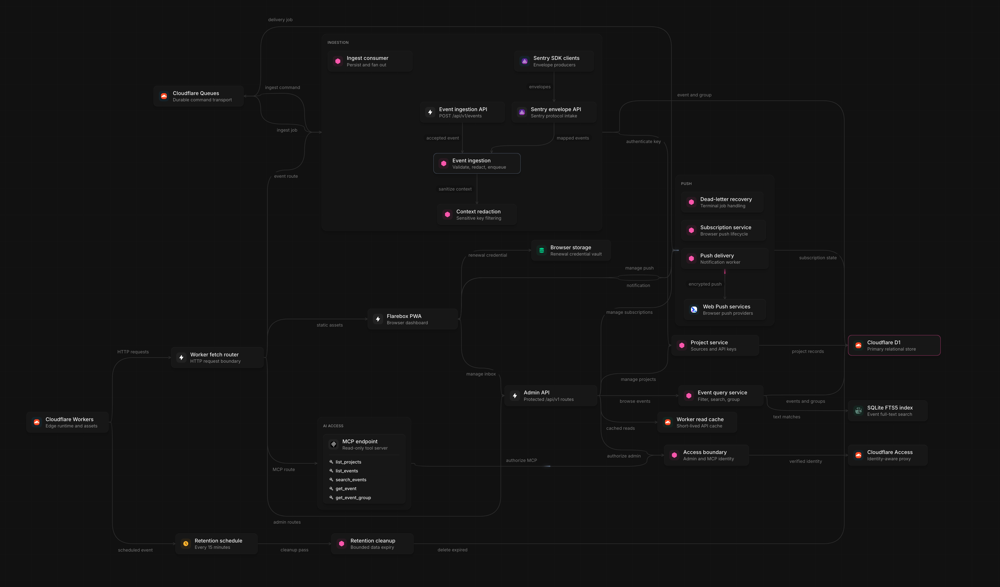

<p align="center">
  
</p>

<h1 align="center">Flarebox</h1>

<p align="center">
  
  
</p>

A tiny, self-hosted notification inbox for developers. Something happened in one of your apps; Flarebox tells you on every enrolled browser.

One Cloudflare Worker, one D1 database, and standards-based Web Push. There is no native app, Slack workspace, Telegram bot, hosted relay, or always-running server to operate.

```bash
curl https://flarebox.example.com/api/v1/events \
  -H "Authorization: Bearer ops_proj_REPLACE_ME" \
  -H "Content-Type: application/json" \
  -d '{"title":"Backup complete","level":"success"}'
```

Flarebox is the Cloudflare + Effect interpretation of the idea behind [Boop](https://github.com/chrisgreg/boop): an application posts an operational event, the event is stored in a focused inbox, and enrolled browser installations receive native notifications.

## Features

- Receive operational events through a small JSON API or an existing server-side Sentry SDK.
- Browse, search, filter, group, silence, and export events from an installable PWA.
- Send encrypted Web Push notifications, including up to three event action links.
- Isolate event sources with project-scoped API keys, notification thresholds, and key rotation.
- Redact sensitive context before durable processing and store only hashed credentials.
- Preserve accepted events with Queue-backed ingestion, idempotency, retries, and dead-letter recovery.
- Give coding and operations agents optional read-only access through five MCP tools.
- Self-host the entire service on one Cloudflare Worker, one Queue, and one D1 database.

The repository is production-oriented but remains pre-1.0. See [ROADMAP.md](ROADMAP.md) for remaining hardening work and [CHANGELOG.md](CHANGELOG.md) for release details.

## Capacity and Cloudflare tiers

Current Cloudflare limits as of **September 3, 2026**:

| Limit | Workers Free | Workers Paid |
| --- | ---: | ---: |
| Worker requests | 100,000/day | 10 million/month included, then metered |
| HTTP CPU per invocation | 10 ms | 30 seconds default, configurable up to 5 minutes |
| D1 database size | 500 MB | 10 GB |
| Total D1 storage | 5 GB/account | 1 TB/account |
| D1 rows read | 5 million/day | 25 billion/month included, then metered |
| D1 rows written | 100,000/day | 50 million/month included, then metered |
| Queue operations | 10,000/day | 1 million/month included, then metered |
| Queue message retention | 24 hours | 4 days by default, configurable to 14 days |

Sources: [Workers limits](https://developers.cloudflare.com/workers/platform/limits/), [D1 limits](https://developers.cloudflare.com/d1/platform/limits/), [D1 pricing](https://developers.cloudflare.com/d1/platform/pricing/), and [Queues pricing](https://developers.cloudflare.com/queues/platform/pricing/).

The latest opt-in local benchmark used **1,000 projects and 1,000,000 events**. It measured a 902.8 MiB database, 946.2 database bytes and 14.7 D1 rows written per event. Those values produce these single-database estimates:

| Flarebox capacity | Workers Free | Workers Paid |
| --- | ---: | ---: |
| Projects | 1,000 verified; no application cap | 1,000 verified; no application cap |
| Stored events | ~528,449 at 500 MB | ~10,568,995 at 10 GB |
| New events within the D1 write allowance | ~6,802/day | ~3,401,360/month included |
| Events within the measured Queue allowance | ~1,666/day | ~166,666/month included |

Project lists are paginated at 100; project count is ultimately bounded by the shared D1 database rather than an application limit. The Queue estimate uses the measured fingerprint-collapsed fan-out of one delivery job per event: one ingestion message plus one delivery message, normally three Queue operations each. More subscribers, retries, or unfingerprinted events reduce it; events that create no delivery job increase it. D1 write estimates exclude delivery and retention writes.

The same local run measured event-list/search p95 latency of 8–36 ms, ingestion acceptance at 970.9 requests/s with 31 ms p95, Queue consumption at 361 events/s with eight consumers and 364 ms p95 lag, and retention at 6,958.9 events/s. These are synthetic local regression results, not Cloudflare production throughput guarantees. The repository currently requests 1,000 ms of Worker CPU, so the 10 ms Free tier is not a validated production target. See [backend scale controls](docs/backend-scale.md) for the benchmark and operating assumptions.

## Architecture

[](https://foglamp.dev/scan/flarebox-nllgug)

[View the interactive architecture diagram](https://foglamp.dev/scan/flarebox-nllgug).

Cloudflare Queue is the durable acceptance boundary. The HTTP endpoint returns `202 Accepted` only after a schema-versioned `IngestEvent` command is accepted. Its consumer idempotently creates the event and jobs, then publishes `DeliverPush` commands before acknowledging. Queue redelivery resumes partial fan-out without a repair Cron. D1 owns delivery claims, attempt limits, dead jobs, and successful delivery records; Queue owns retry timing. See [event ingestion](docs/event-ingestion.md) and [Web Push delivery lifecycle](docs/delivery.md).

MCP, HTTP, Queue consumption, and scheduled maintenance intentionally remain one
modular Worker deployment until production isolation or scaling evidence justifies the
extra operational boundary. See [ADR 0002](docs/decisions/0002-retain-single-worker-deployment.md)
for the measured bundle baseline, decision triggers, and requirements for a safe split.

## Requirements

- Node.js 22.12 or newer.
- pnpm.
- A Cloudflare account with Workers, D1, Queues, and a domain or `workers.dev` hostname.
- An HTTPS production origin. Browser push subscriptions require a secure context.

On iPhone and iPad, open the site in Safari, add it to the Home Screen, launch the installed PWA, and grant notification permission from a user gesture.

## Local setup

```bash
pnpm install
cp .dev.vars.example .dev.vars
pnpm secrets -- --subject mailto:you@example.com
```

Copy the generated values into `.dev.vars`. Never commit `.dev.vars`.

Create local D1 state and apply all migrations:

```bash
pnpm exec wrangler d1 migrations apply ops-context --local
```

Build the PWA and launch the Worker:

```bash
pnpm build:web
pnpm dev
```

For frontend-only development with API proxying:

```bash
# terminal 1
pnpm dev

# terminal 2
pnpm dev:web
```

The PWA dev server is at `http://localhost:5173`; API requests are proxied to Wrangler at `http://localhost:8787`.

## Cloudflare provisioning

Create D1 and put the returned database id into `wrangler.jsonc`:

```bash
pnpm exec wrangler d1 create ops-context
```

Create the primary and dead-letter Queues:

```bash
pnpm exec wrangler queues create ops-context-push
pnpm exec wrangler queues create ops-context-push-dlq
```

Generate the VAPID keys:

```bash
pnpm secrets -- --subject mailto:you@example.com
```

Upload each generated value. Wrangler prompts for values without storing them in shell history:

```bash
pnpm exec wrangler secret put VAPID_PUBLIC_KEY
pnpm exec wrangler secret put VAPID_PRIVATE_JWK
pnpm exec wrangler secret put VAPID_SUBJECT
```

Configure the Cloudflare Access hostnames/audiences, `OPS_BASE_URL`, and default retention in `wrangler.jsonc`, then apply migrations and deploy:

```bash
pnpm exec wrangler d1 migrations apply ops-context --remote
pnpm deploy
```

## Install and enroll the PWA

1. Open the deployed origin and sign in.
2. Install the PWA. Chrome and Edge expose an install prompt. On iOS, use Safari → Share → **Add to Home Screen**.
3. Launch the installed application.
4. Select **Enable push** and approve notifications.
5. Go to **Projects**, create a project, and copy its API key.
6. Use **Test** on the project row to verify end-to-end Queue and Web Push delivery.

Every browser installation gets its own Web Push subscription and one-time, installation-scoped renewal credential. The raw credential stays in IndexedDB while only its hash is stored in D1. The dashboard can rename, disable, or remove subscriptions; disabling or removing one also revokes its renewal credential. See [PWA push-subscription renewal](docs/push-renewal.md).

## Send an event

```bash
curl https://flarebox.example.com/api/v1/events \
  -H "Authorization: Bearer ops_proj_REPLACE_ME" \
  -H "Content-Type: application/json" \
  -d '{
    "title": "Deploy completed",
    "body": "api@7d18b7f is serving production traffic",
    "level": "success",
    "source": "github-actions",
    "type": "deployment",
    "fingerprint": "production-api-deploy",
    "external_id": "github-run-12345",
    "data": {
      "environment": "production",
      "commit": "7d18b7f",
      "authorization": "this value is redacted before storage"
    },
    "actions": [
      {
        "label": "Open run",
        "url": "https://github.com/example/repository/actions/runs/12345"
      }
    ]
  }'
```

A successful Queue acceptance returns HTTP `202 Accepted`:

```json
{
  "id": "evt_...",
  "accepted_at": "2026-08-31T12:00:00.000Z",
  "status": "queued"
}
```

The event is eventually consistent: it may briefly return `404` from the administrator read API until the Queue consumer persists it. A Queue publication failure returns `503`, and the client should retry. Reusing `external_id` gives producer retries the same event id.

Levels are `info`, `success`, `warning`, `error`, and `critical`.

Actions are optional. An event may contain at most three actions; labels are limited to 40 characters, URLs must be absolute, and unsafe local/script schemes are refused.

The raw HTTP body is limited to **256 KiB**, and the normalized event is limited to **60,000 encoded bytes** so its versioned command stays within one Cloudflare Queue billing chunk. Titles, bodies, identifiers, timestamps, actions, and structured context are validated by a shared Effect Schema contract; invalid values are rejected rather than truncated. See [the event ingestion contract](docs/event-ingestion.md) for every field and structural limit.

### Sentry SDKs — drop-in DSN

Flarebox accepts the Sentry envelope protocol, so an existing server-side Sentry SDK can report here without changing application code. Hex-encode the project API key and prefix it with `ops_sentry_` so it fits Sentry's DSN public-key syntax:

```text
SENTRY_DSN=https://ops_sentry_HEX_ENCODED_PROJECT_KEY@flarebox.example.com/1
```

The Worker decodes the value before `@` and authenticates the original Flarebox project key. The trailing project id is required by Sentry's DSN format but ignored. The Worker accepts `POST /api/{id}/envelope/`, including gzip- and deflate-compressed envelopes.

> **Keep this DSN server-side.** Unlike a normal Sentry DSN, it contains a write-capable Flarebox project key. Do not embed it in browser, mobile, or other untrusted client code.

Exception events use `Type: value` titles, compact stack/context bodies, Sentry level mapping, `source: "sentry"`, and grouping fingerprints. Message events group on their unformatted templates. Curated context is stored in `data` and passes through the same redaction, silence, D1, durable push-job, and Queue pipeline as `/api/v1/events`. Transactions, sessions, attachments, and other non-error items are accepted and ignored.

See [docs/sentry.md](docs/sentry.md) for authentication, mapping, limits, and a raw envelope example.

### Shell helper

```bash
ops_event() {
  curl -fsS "$FLAREBOX_URL/api/v1/events" \
    -H "Authorization: Bearer $FLAREBOX_API_KEY" \
    -H "Content-Type: application/json" \
    -d "$(jq -n \
      --arg title "$1" \
      --arg body "${2:-}" \
      --arg level "${3:-info}" \
      '{title:$title, body:$body, level:$level}')"
}

pg_dump app > backup.sql \
  && ops_event "Backup complete" "" success \
  || ops_event "Backup failed" "$(tail -n 1 backup.log)" error
```

## Inbox grouping and filters

Use the PWA’s **Group repeats** toggle, or call:

```http
GET /api/v1/events?grouped=true
```

Events with the same non-empty fingerprint are grouped only within their project. The latest occurrence represents the row and includes:

```json
{
  "group": {
    "count": 47,
    "first_seen": "2026-08-30T09:31:00.000Z",
    "last_seen": "2026-08-30T10:42:00.000Z"
  }
}
```

The default grouped inbox reads a measured project-scoped read model. Filters
that depend on individual occurrences automatically use the exact dynamic
query. See [Grouped inbox read model](docs/grouped-inbox-read-model.md) for the
measurements, retention behavior, and idempotent repair operation.

Supported event-list query parameters are:

```text
project, level, source, fingerprint, search,
since, until, grouped, silenced, before, limit
```

`since` and `until` use RFC 3339 timestamps and apply to `created_at`. All active filters are applied before fingerprint grouping.

## MCP for agents

The optional `/mcp` endpoint exposes these read-only tools:

```text
list_projects
list_events
search_events
get_event
get_event_group
```

Configure the MCP Cloudflare Access application and audience, then enable MCP from **Settings** in the PWA. Access user and service-token identities are accepted according to that policy; project ingestion keys are explicitly refused.

See [docs/mcp.md](docs/mcp.md) for transport details, authentication, and example requests.

## HTTP API

All JSON errors have the form:

```json
{ "error": "code", "message": "human-readable message" }
```

| Method | Path | Authentication | Purpose |
|---|---|---|---|
| GET | `/health` | none | D1 health check |
| POST | `/api/v1/events` | project bearer key | Queue an event (`202 Accepted`) |
| POST | `/api/:id/envelope/` | Sentry DSN project key | Ingest Sentry SDK error envelopes |
| GET | `/api/v1/events` | administrator | List, search, filter, paginate, or group events |
| GET | `/api/v1/events/:id` | administrator | Read complete event context and actions |
| GET | `/api/v1/events/:id/deliveries` | administrator | Delivery attempts |
| POST | `/api/v1/events/:id/unsilence` | administrator | Clear silence and push |
| GET/POST | `/api/v1/projects` | administrator | List/create projects |
| GET/PATCH/DELETE | `/api/v1/projects/:id` | administrator | Manage project |
| POST | `/api/v1/projects/:id/rotate-key` | administrator | Rotate project key |
| GET | `/api/v1/push/public-key` | none | VAPID public key |
| GET/POST | `/api/v1/push/subscriptions` | administrator | List/enroll PWA installations |
| PATCH/DELETE | `/api/v1/push/subscriptions/:id` | administrator | Manage PWA installation |
| POST | `/api/v1/push/subscriptions/:id/renew` | installation renewal credential | Replace that installation's endpoint and rotate its credential |
| GET/POST | `/api/v1/silences` | administrator | List/create silence rules |
| GET/DELETE | `/api/v1/silences/:id` | administrator | Read/delete rule |
| GET/PATCH | `/api/v1/settings` | administrator | Retention, redaction, setup, and MCP enablement |
| GET | `/api/v1/status` | administrator | Deployment status and counts |
| POST | `/api/v1/test` | administrator | Create and push a test event |
| POST | `/mcp` | Cloudflare Access | Read-only MCP Streamable HTTP endpoint |

The generated OpenAPI document is available at:

```text
/api/v1/openapi.json
```

The Sentry compatibility route is handled at the Worker fetch boundary rather than by `HttpApi`, so it is documented here and in [docs/sentry.md](docs/sentry.md) instead of the generated OpenAPI document.

Administrator and MCP authentication use Cloudflare Access only. Project bearer keys are explicitly rejected on administrative and MCP routes.

## Effect v4 structure

The Worker boundary is a standard Cloudflare module handler. Inside that boundary:

- `HttpApi`, endpoint/group schemas, and `HttpApiMiddleware` define and validate the HTTP contract.
- Tagged domain and application errors are mapped to HTTP only by the API adapter; see [docs/errors.md](docs/errors.md).
- `Projects`, `Events`, `Subscriptions`, `Silences`, `Settings`, `EventIngestion`, `PushDelivery`, `Retention`, `McpEndpoint`, and `SentryEndpoint` are narrow Effect services.
- Live implementations are assembled through `Layer` composition in `worker/src/layers.ts`.
- `ManagedRuntime` builds the application graph once per Worker isolate and reuses it for Fetch, Queue, scheduled retention, MCP, and Sentry envelope executions.
- A narrow `Database` service uses native D1 results to preserve atomic batches and capture per-query row and duration metadata.
- Effect’s `Crypto.Crypto` capability generates and hashes high-entropy credentials, while Web Push cryptography remains behind the `WebPush` service.
- The official MCP TypeScript SDK is wrapped by an Effect service rather than leaking protocol/runtime concerns into domain logic.

Domain and application services expose typed Effect programs. Cloudflare bindings and Web APIs are supplied only through infrastructure Layers.

## Security model

- Project credentials are treated as high-entropy secrets and stored only as SHA-256 hashes.
- Sentry DSNs contain a write-capable project key and must stay in trusted server-side configuration.
- Cloudflare Access is the only production administrator and MCP identity provider.
- Browser administrative mutations are restricted to the configured same origin.
- MCP checks the request host/origin before protocol dispatch and receives only a validated read-only principal.
- Web Push payloads are encrypted according to the Web Push protocol before they are handed to browser push services.
- Event action URLs are validated on ingestion and rendered with safe external-link behavior in the PWA.
- Common secret-bearing object keys are recursively redacted before event context reaches D1. Operators can add custom keys.
- Queue consumers disable expired subscriptions after HTTP 404 or 410 responses.
- The API applies request-size and field-length limits.

Review [SECURITY.md](SECURITY.md) before exposing an instance publicly.

## Development

```bash
pnpm typecheck
pnpm test
pnpm build:web
pnpm build:worker
```

The full check runs strict Worker/PWA type checks, Vitest, a production Vite build, and a Wrangler dry-run Worker bundle:

```bash
pnpm check
```

## License

MIT. See [LICENSE](LICENSE).

## Architecture and operations

The production security, Queue/D1 cost model, DLQ alerts, no-Cron deployment, and smoke-test checklist are documented in [`docs/operations-hardening.md`](docs/operations-hardening.md).
